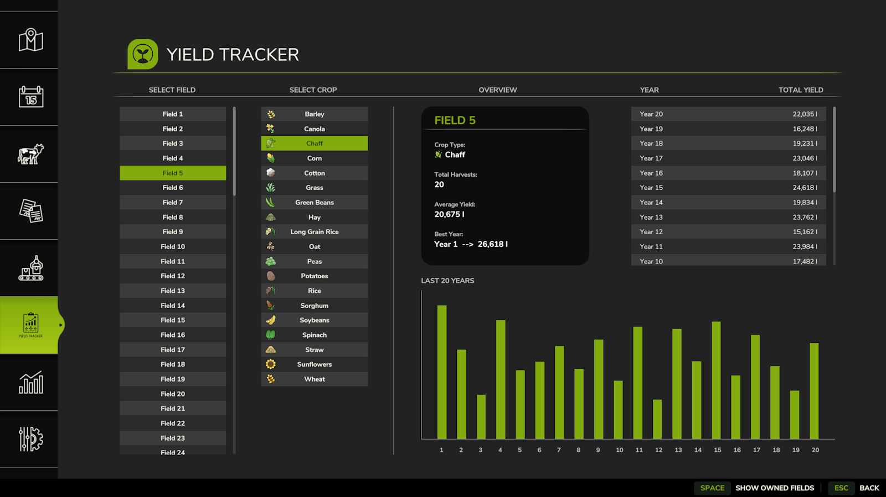
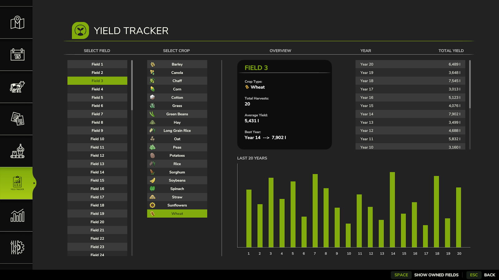

# YieldTracker

> ⚠️ **Note:** This mod currently supports **Singleplayer** mode only on **PC/Mac**.

**YieldTracker** helps you keep track of your harvests across different fields and years in Farming Simulator. It logs total yields by **crop (fill type)**, **field number**, and **year**, so you can easily monitor your farm’s performance over time.

Whether you're managing fields on your own or working with **AI workers** or **contract jobs**, YieldTracker automatically records your results for later review.

---

## 📷 Screenshots

  

---

## ✅ Features

- Tracks total yields per **field**, **crop type**, and **harvest year**
- Automatically logs results while using AI workers or doing contracts
- Simple and non-intrusive—just harvest like normal!
- Great for **long-term farm planning** and **crop rotation optimization**

---

## 📦 Supported Fill Types (18)

- Wheat  
- Barley  
- Oat  
- Canola  
- Corn  
- Soybeans  
- Sorghum  
- Sunflowers  
- Cotton  
- Rice  
- Long Grain Rice  
- Peas  
- Spinach  
- Green Beans  
- Chaff  
- Grass *(baler only)*  
- Straw *(baler only)*  
- Hay *(baler only)*  

---

## 📂 Installation

1. Download the `.zip` file from the [Releases](../../releases) section.
2. Move it into your `mods` folder:
   - On Windows: `Documents\My Games\FarmingSimulator2025\mods`
3. Launch the game and activate the mod from the in-game Mods menu.

---

## 🧩 Compatibility

- ✔️ Works in **Singleplayer**
- ✔️ Compatible with **AI workers** and **contracts**

---

## 📣 Feedback & Issues

Found a bug or have a feature suggestion? Navigate to the [Issues](../../issues) section on this repository to let us know.

---

## 📜 License

This mod is open-source. You may view, modify, or contribute to it via the GitHub repository.
Redistribution is not permitted without explicit permission from the original author.
If you modify or use parts of this code, please provide proper credit.
